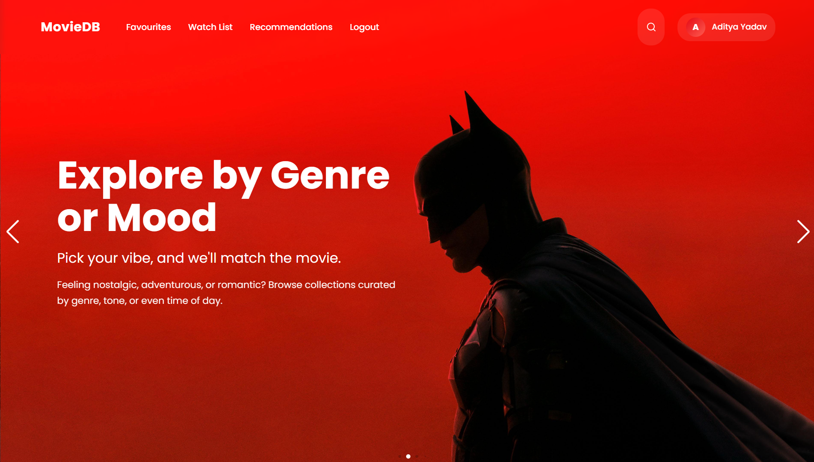
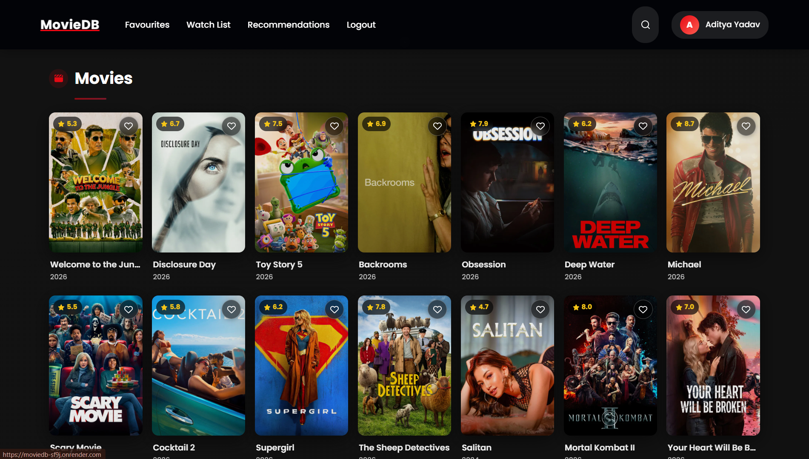
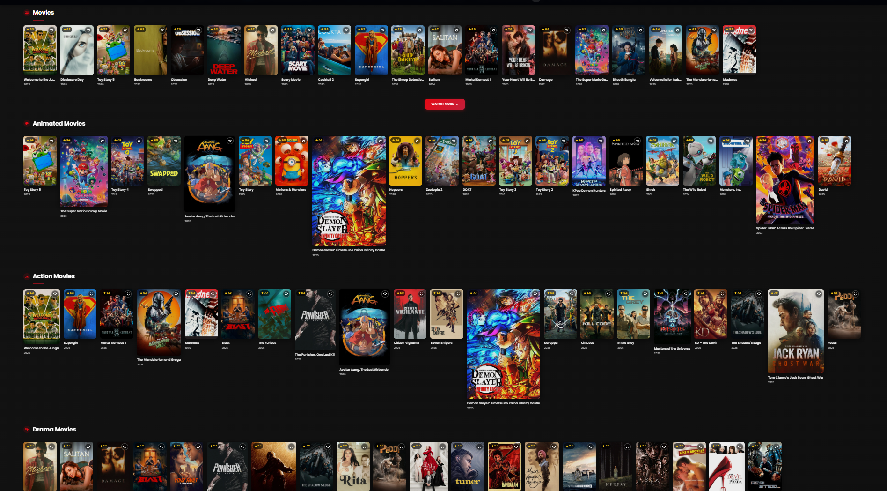
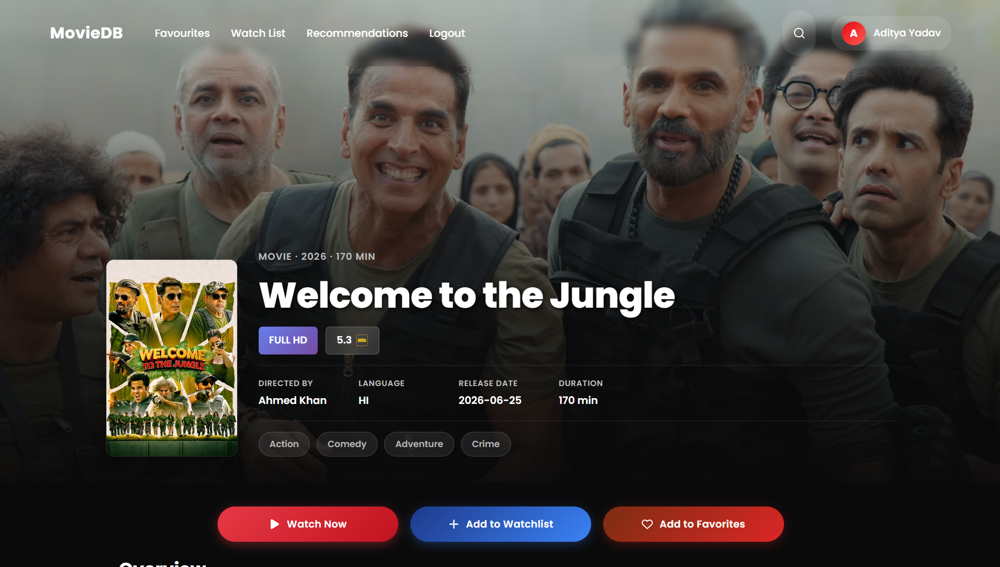
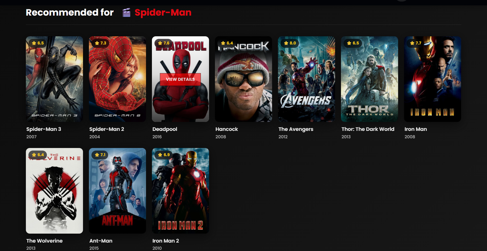
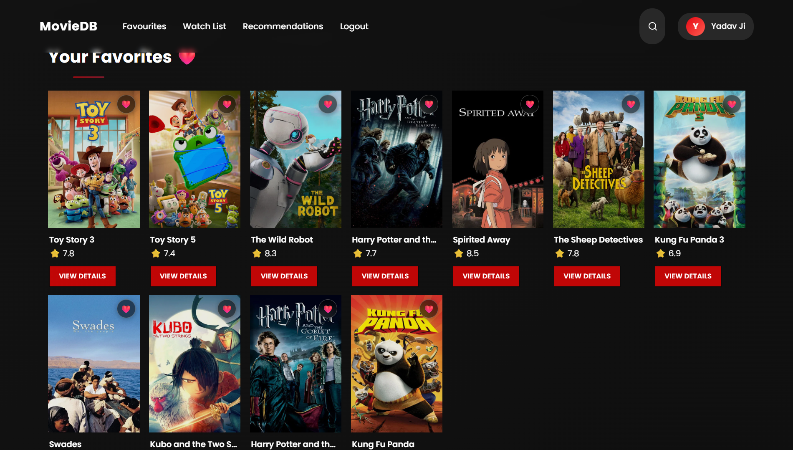
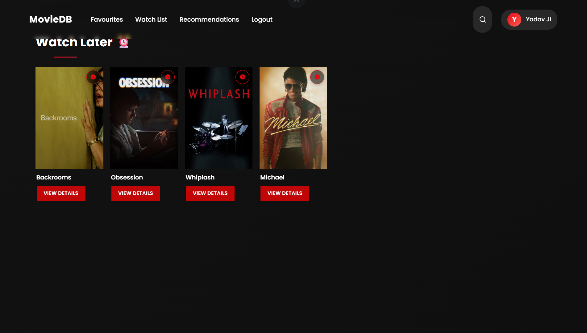
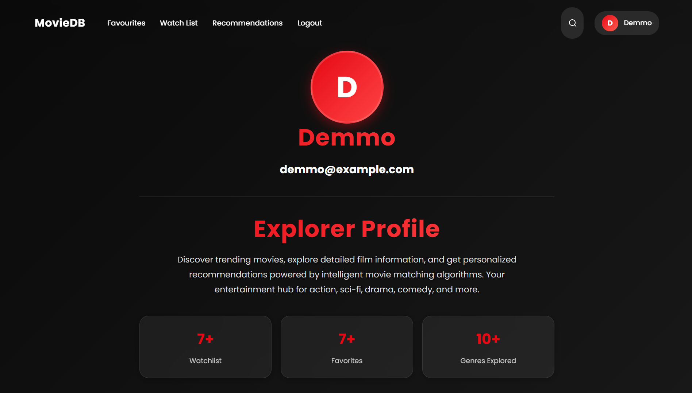
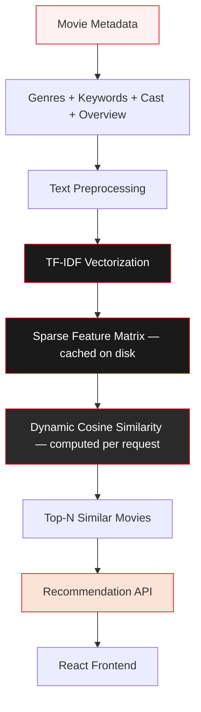
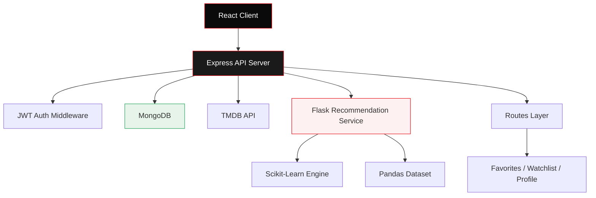

<div align="center">

# MovieDB

### Discover. Watch. Organize. Recommend.

MovieDB is a modern movie discovery and recommendation platform that pairs an intelligent, content-based recommendation engine with an immersive, Netflix-style browsing experience.

<br/>

[](https://react.dev/)
[](https://vitejs.dev/)
[](https://nodejs.org/)
[](https://expressjs.com/)
[](https://www.python.org/)
[](https://flask.palletsprojects.com/)
[](https://scikit-learn.org/)
[](https://pandas.pydata.org/)
[](https://www.mongodb.com/)
[](https://www.themoviedb.org/documentation/api)
[](https://jwt.io/)
[](#)
[](LICENSE)
[](#future-roadmap)

</div>

<br/>

---

## Why MovieDB

Traditional movie sites are catalogs — endless grids with no sense of what _you_ actually want to watch tonight. Search returns everything and nothing. "Trending" means trending for someone else. The result is decision fatigue dressed up as choice.

MovieDB takes a different approach: every interaction — a favorite, a watchlist add, a search — feeds a recommendation engine that narrows the catalog down to what's actually relevant to you. Discovery stops being a chore and starts being a conversation between you and the platform.

**What MovieDB solves:**

- **Choice overload** — thousands of titles collapse into a short, relevant list through content-based filtering rather than raw popularity.
- **Shallow browsing** — full metadata (cast, runtime, genres, ratings, similar titles) is surfaced on every title, not hidden behind extra clicks.
- **Lost intent** — Favorites and Watchlist persist what you cared about, so a good find never disappears into scroll history.
- **Generic recommendations** — similarity is computed from real movie metadata (genres, keywords, overview) using TF-IDF and cosine similarity, not just "people also watched."

---

## Core Features

<table>
<tr><th width="60">Icon</th><th>Feature</th><th>Description</th></tr>

<tr><td>🎬</td><td><b>Movie Discovery</b></td><td>Browse thousands of movies pulled live from TMDB, organized into curated rows by genre and mood.</td></tr>

<tr><td>❤️</td><td><b>Favorites</b></td><td>Save any title to a personal Favorites collection with a single click.</td></tr>

<tr><td>📌</td><td><b>Watchlist</b></td><td>Build a dedicated "watch later" queue, separate from Favorites, for what's next in line.</td></tr>

<tr><td>🤖</td><td><b>AI Recommendations</b></td><td>Personalized suggestions generated by a content-based recommendation algorithm built on movie metadata.</td></tr>

<tr><td>🔎</td><td><b>Smart Search</b></td><td>Instant, responsive search across the full movie catalog.</td></tr>

<tr><td>🎭</td><td><b>Genres</b></td><td>Browse curated rows by genre — Action, Animated, Drama, and more.</td></tr>

<tr><td>📖</td><td><b>Movie Details</b></td><td>Full detail pages with ratings, overview, release date, runtime, genres, cast, and similar movies.</td></tr>

<tr><td>👤</td><td><b>User Profile</b></td><td>An explorer-style profile showing account info and activity stats — watchlist count, favorites count, genres explored.</td></tr>

<tr><td>⭐</td><td><b>Ratings</b></td><td>IMDb-style ratings displayed on every poster and detail page.</td></tr>

<tr><td>📱</td><td><b>Responsive Design</b></td><td>A fully responsive interface optimized for desktop, tablet, and mobile.</td></tr>

</table>

---

## Screenshots

<table width="100%">
<tr>
<td align="center" colspan="2">

<br/><sub><b>Hero Banner</b> — mood and genre-based discovery on the home page.</sub>
</td>
</tr>
</table>

<table width="100%">
<tr>
<td align="center" colspan="2">

<br/><sub><b>Home Page</b> — curated rows for Movies, Animated, Action, and Drama.</sub>
</td>
</tr>
</table>

<table width="100%">
<tr>
<td width="50%" align="center">

<br/><sub><b>Movie Grid</b> — browse the full catalog with ratings and quick favorite toggles.</sub>
</td>
<td width="50%" align="center">

<br/><sub><b>Movie Details</b> — director, language, runtime, genres, and watch actions.</sub>
</td>
</tr>
</table>

<table width="100%">
<tr>
<td width="50%" align="center">

<br/><sub><b>Recommendations</b> — similar titles generated from content-based filtering.</sub>
</td>
<td width="50%" align="center">

<br/><sub><b>Favorites</b> — every movie saved for quick access.</sub>
</td>
</tr>
</table>

<table width="100%">
<tr>
<td width="50%" align="center">

<br/><sub><b>Watchlist</b> — a dedicated queue of titles to watch next.</sub>
</td>
<td width="50%" align="center">

<br/><sub><b>Profile</b> — account details and at-a-glance activity stats.</sub>
</td>
</tr>
</table>

---

## Recommendation System

MovieDB's recommendation engine is **content-based**: rather than relying on what other users watched, it measures how similar a movie's own metadata is to every other movie in the catalog.

The pipeline combines each movie's genres, keywords, cast, and overview into a single text profile. That profile is converted into a numerical vector using **TF-IDF vectorization**, which weighs terms by how distinctive they are to a given movie rather than how often they appear across the catalog. When a user requests recommendations, cosine similarity is computed **dynamically** between the selected movie's vector and the entire feature matrix — a 1×N operation that completes in milliseconds. This eliminates the need to store a 119 MB similarity matrix while delivering identical results.



---

## Architecture



---

## Technology Stack

| Category                  | Technology           | Purpose                                                 |
| ------------------------- | -------------------- | ------------------------------------------------------- |
| **Frontend**              | React, Vite          | Fast, component-driven single-page application          |
| **Backend**               | Node.js, Express     | REST API, routing, session orchestration                |
| **Recommendation Engine** | Flask                | Lightweight Python microservice serving recommendations |
| **Machine Learning**      | Scikit-Learn, Pandas | TF-IDF vectorization and cosine similarity computation  |
| **Authentication**        | JWT                  | Stateless, token-based user authentication              |
| **Database**              | MongoDB              | Stores users, favorites, watchlists, and profile data   |
| **APIs**                  | TMDB API             | Live movie metadata, posters, cast, and ratings         |
| **Styling**               | Tailwind CSS         | Responsive, utility-first UI styling                    |
| **Icons**                 | Lucide / Heroicons   | Consistent iconography across the interface             |
| **Deployment**            | Render-compatible    | Production deployment for client, server, and ML API    |

---

## Folder Structure

```
MovieDB/
├── client/                       # React + Vite frontend application
├── server/                       # Backend services
│   ├── src/                      # Express API server (routes, auth, MongoDB models)
│   ├── app.py                    # Flask recommendation API
│   ├── recommendation_engine.py  # Dynamic cosine similarity engine
│   ├── preprocessing.py          # Dataset cleaning and TF-IDF vectorization
│   ├── cache_manager.py          # Smart cache validation and generation
│   ├── utils.py                  # SHA-256 hashing utilities
│   ├── cache/                    # Auto-generated ML artifacts (gitignored)
│   ├── requirements.txt          # Python dependencies
│   └── Procfile                  # Render start command
│
├── readme.md                     # You are here
└── .gitignore
```

| Folder / File             | Responsibility                                                                  |
| ------------------------- | ------------------------------------------------------------------------------- |
| `client/`                 | The React application — pages, components, and UI logic.                        |
| `server/src/`             | The Express API — auth, favorites, watchlist, profile.                          |
| `server/app.py`           | Flask application serving the `/recommend` and `/health` API endpoints.         |
| `server/cache_manager.py` | Validates, generates, and loads the ML cache on startup.                        |
| `server/cache/`           | Auto-generated sparse TF-IDF matrix and lookup structures. Never committed.     |

---

## Installation

**1. Clone the repository**

```bash
git clone https://github.com/<your-username>/moviedb.git
cd moviedb
```

**2. Install frontend dependencies**

```bash
cd client
npm install
```

**3. Install backend dependencies**

```bash
cd ../server
npm install
```

**4. Install Python dependencies (recommendation service)**

```bash
cd ../recommendation
pip install -r requirements.txt
```

**5. Configure environment variables**

Create a `.env` file in `server/` and `recommendation/` (see table below) and fill in your own values.

**6. Run the Flask recommendation API**

```bash
cd recommendation
python app.py
```

**7. Run the Express server**

```bash
cd ../server
npm run dev
```

**8. Run the React client**

```bash
cd ../client
npm run dev
```

The app will be available at `http://localhost:5173`.

---

## Environment Variables

| Variable        | Description                                                                |
| --------------- | -------------------------------------------------------------------------- |
| `TMDB_API_KEY`  | API key for fetching movie metadata, posters, and ratings from TMDB        |
| `JWT_SECRET`    | Secret key used to sign and verify JWT authentication tokens               |
| `MONGO_URI`     | Connection string for the MongoDB database                                 |
| `PORT`          | Port the Express server listens on                                         |
| `FLASK_API_URL` | Base URL the Express server uses to reach the Flask recommendation service |

> Never commit your `.env` files. Add them to `.gitignore`.

---

## Usage Guide

<div align="center">

**1. Register**
↓
**2. Login**
↓
**3. Browse Movies**
↓
**4. Search**
↓
**5. Open Details**
↓
**6. Add to Favorites**
↓
**7. Add to Watchlist**
↓
**8. Get Recommendations**
↓
**9. Enjoy**

</div>

Every favorite and watchlist addition feeds back into the recommendation engine, so the longer you use MovieDB, the more relevant its suggestions become.

---

## Highlights

<table>
<tr>
<td width="25%" align="center"><b>🤖 Recommendation Engine</b><br/><sub>Content-based, metadata-driven</sub></td>
<td width="25%" align="center"><b>❤️ Favorites</b><br/><sub>Save and revisit instantly</sub></td>
<td width="25%" align="center"><b>📌 Watchlist</b><br/><sub>A dedicated watch-later queue</sub></td>
<td width="25%" align="center"><b>🔎 Smart Search</b><br/><sub>Fast, full-catalog lookup</sub></td>
</tr>
<tr>
<td width="25%" align="center"><b>🎬 TMDB Integration</b><br/><sub>Live metadata and posters</sub></td>
<td width="25%" align="center"><b>🔐 Authentication</b><br/><sub>JWT-secured sessions</sub></td>
<td width="25%" align="center"><b>📱 Responsive Design</b><br/><sub>Built for every screen size</sub></td>
<td width="25%" align="center"><b>⭐ Ratings</b><br/><sub>IMDb-style scoring on every title</sub></td>
</tr>
</table>

---

## Future Roadmap

- [x] Authentication
- [x] Favorites
- [x] Watchlist
- [x] Recommendations
- [x] Search
- [x] Movie Details
- [x] Responsive UI
- [ ] Collaborative Filtering
- [ ] AI Chat Movie Assistant
- [ ] Streaming Platform Links
- [ ] Trailer Recommendation
- [ ] Mood-Based Recommendation
- [ ] Voice Search
- [ ] Progressive Web App
- [ ] Mobile Application

---

## Security

- **JWT Authentication** — stateless tokens verify every authenticated request.
- **Protected Routes** — Favorites, Watchlist, and Profile endpoints require a valid session.
- **Password Hashing** — credentials are hashed before storage, never kept in plain text.
- **Secure API Calls** — TMDB and internal API requests are made server-side, keeping keys out of the client.
- **Environment Variables** — secrets and connection strings are never hardcoded.
- **Input Validation** — incoming requests are validated before reaching the database layer.

---

## Performance

- Fast, debounced search across the full movie catalog.
- **Dynamic cosine similarity** computed per request in ~2ms — no precomputed NxN matrix needed.
- **Smart caching** with SHA-256 validation — cache regenerates only when source data changes.
- **97% storage reduction** — from ~120 MB (similarity matrix) to ~3 MB (sparse feature matrix + metadata).
- Lazy loading of poster images and below-the-fold content rows.
- A responsive UI tuned for smooth scrolling through large movie grids.
- Minimal, batched API calls between the client, server, and recommendation service.

---

## Contributing

Contributions are welcome and appreciated.

1. Fork the repository
2. Create a feature branch — `git checkout -b feature/your-feature`
3. Commit your changes — `git commit -m "Add: your feature"`
4. Push to your branch — `git push origin feature/your-feature`
5. Open a Pull Request

Please keep PRs focused and include a clear description of the change. For larger features, open an issue first to discuss direction.

---

## License

This project is licensed under the **MIT License** — see the [LICENSE](LICENSE) file for details.

---

<div align="center">

## Author

**Aditya Yadav**

[](https://github.com/)
[](https://linkedin.com/)
[](mailto:aditya.yadav992636@gmail.com)

<sub>Built for people who just want to find something good to watch.</sub>

</div>
